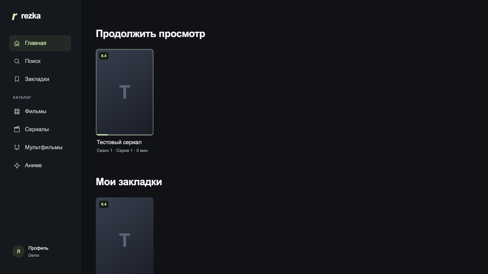
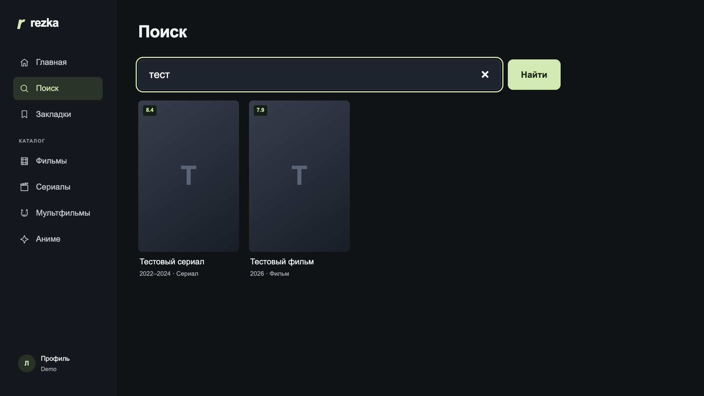
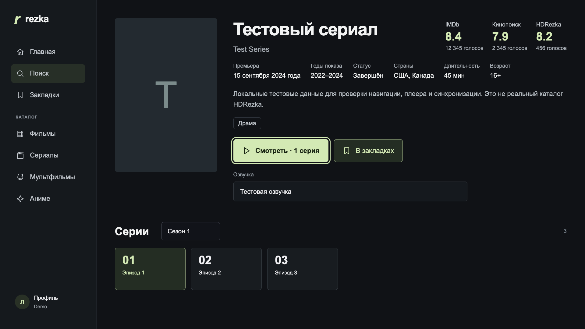
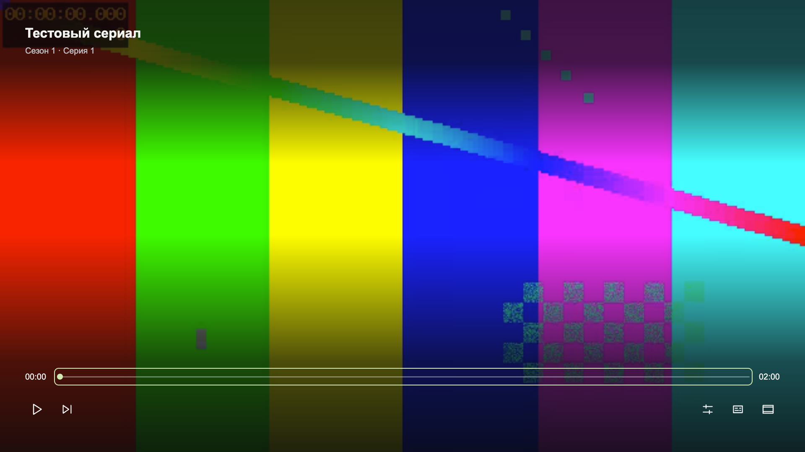

<p align="center">
  
</p>

<h1 align="center">Rezka Client для webOS TV</h1>

<p align="center">
  Неофициальный самостоятельный клиент HDRezka для телевизоров LG с webOS.
  После установки компьютер или домашний сервер не нужны.
</p>

<p align="center">
  <a href="https://github.com/TMichaelan/webos-rezka-client/releases/latest">Скачать IPK</a>
  ·
  <a href="LICENSE">MIT License</a>
</p>

> Проект не связан с HDRezka или LG Electronics. Он не содержит и не распространяет фильмы, сериалы, постеры, субтитры или аккаунты. Пользователь самостоятельно отвечает за законность доступа к контенту в своей стране.

## Возможности

- Каталог, поиск и карточки фильмов и сериалов.
- Трейлеры, рейтинги, все части франшизы и график выхода серий.
- Актёры и режиссёры с отдельной фильмографией по ролям.
- Выбор озвучки, сезона и серии до запуска плеера.
- Качество до 4K, 2K и 1080p Ultra, когда источник и телевизор его поддерживают.
- Субтитры, смена формата изображения, перемотка с ускорением и переход между сериями.
- Управление стрелками, OK, Back и Magic Remote.
- Гостевой режим без обязательного входа.
- После входа: закладки, просмотренные серии, «Продолжить просмотр» и Premium-варианты источника.
- Точная позиция хранится локально на телевизоре. Текущий фильм/сериал и серия синхронизируются через аккаунт HDRezka.
- Приложение и сетевой JS-сервис устанавливаются одним IPK.

## Скриншоты

| Главная | Поиск |
| --- | --- |
|  |  |

| Карточка сериала | Плеер |
| --- | --- |
|  |  |

Скриншоты сделаны на локальных тестовых данных. Реальные аккаунты и контент не использовались.

## Установка

1. Включите Developer Mode на телевизоре и подключите его через webOS Dev Manager или webOS CLI.
2. Скачайте последний файл `.ipk` на странице [Releases](https://github.com/TMichaelan/webos-rezka-client/releases).
3. Установите IPK через webOS Dev Manager.

Через CLI:

```sh
ares-install --device <DEVICE_NAME> io.github.tmichaelan.app.rezkaclient_0.1.15_all.ipk
ares-launch --device <DEVICE_NAME> io.github.tmichaelan.app.rezkaclient
```

Вход в аккаунт необязателен и находится в разделе «Профиль».

## Локальная разработка

Требуются Node.js 20.19+ и npm. Runtime JS-сервиса на телевизоре совместим с Node.js 16.

```sh
npm ci
npm ci --ignore-scripts --omit=dev --prefix service
npm run dev -- --fixture
```

Откройте `http://127.0.0.1:5173`. Fixture-режим использует только синтетические данные:

- логин: `demo@example.test`
- пароль: `demo-only`

Сборка IPK:

```sh
npm run package:ipk
```

Скрипт использует зафиксированную версию `@webos-tools/cli@3.2.6`, собирает приложение из разрешённого списка файлов и сохраняет результат в `artifacts/`.

## Проверка

```sh
npm test
npm run test:e2e
npm run build
npm audit
npm audit --prefix service
```

E2E запускаются на локальном fixture-сервисе и не обращаются к реальному аккаунту.

## Приватность и безопасность

- Пароль существует только в памяти во время входа и сразу очищается.
- Сессионные cookies и позиции просмотра сохраняются только на телевизоре или в локальной `.state/` при разработке.
- Файлы сессии создаются с правами `0600`.
- Телеметрии, аналитики и собственного удалённого сервера нет.
- Runtime обращается к выбранному HTTPS-зеркалу HDRezka и к выданным им медиа/субтитрам. YouTube загружается только после явного открытия трейлера.
- Redirect, TLS, размер ответа и адреса субтитров проверяются; private/reserved IP блокируются.
- Совместимые Anubis 1.x `fast`-проверки определяются по возможностям протокола; неизвестные алгоритмы отклоняются.
- `.state/`, `.env*`, ключи, сертификаты, сборки и IPK исключены из Git.

## Ограничения

- Сайт не предоставляет стабильный публичный API: изменение разметки, anti-bot-защиты или протокола может потребовать обновления клиента.
- Доступные разрешения, HDR, кодеки и звук зависят от конкретного источника и модели телевизора.
- Секунды просмотра не переносятся между телевизором и другими приложениями; между устройствами синхронизируется только состояние, которое хранит сам HDRezka.
- Приложение предназначено для sideload через Developer Mode и не публикуется в LG Content Store.

## Лицензия

Код распространяется по лицензии [MIT](LICENSE). Уведомления о сторонних компонентах находятся в [THIRD_PARTY_NOTICES.txt](THIRD_PARTY_NOTICES.txt) и `webos/licenses/`.
